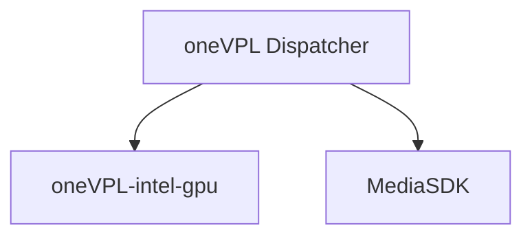

# ffmpeg-docker

[](https://github.com/AkashiSN/ffmpeg-docker/actions/workflows/ffmpeg.yml)

[](https://hub.docker.com/r/akashisn/ffmpeg)

## Available release

- Linux docker image (`akashisn/ffmpeg`) & binary release
  - `7.0.2`
  - `6.1.2`
  - `5.1.6`
  - `4.4.5`
- Windows binary release
  - `7.0.2`
  - `6.1.2`
  - `5.1.6`
  - `4.4.5`

## Supported architecture

- ffmpeg
  - `linux/amd64`

    <details>
    <summary>configure options:</summary>

    ```bash
    --enable-zlib --enable-lzma --enable-gmp --enable-iconv --enable-gnutls --enable-libsrt
    --enable-libopenjpeg --enable-libwebp --enable-libvpx --enable-libx264 --enable-libx265
    --enable-libaom --enable-libvmaf --enable-libopus --enable-libvorbis --enable-libopencore-amrnb
    --enable-libopencore-amrwb --enable-libvo-amrwbenc --enable-libmp3lame --enable-libfreetype
    --enable-libfribidi --enable-libxml2 --enable-libfontconfig --enable-libass --enable-libaribb24
    --enable-sdl2 --enable-cuda-llvm --enable-ffnvcodec --enable-cuvid --enable-nvdec --enable-nvenc
    --enable-libdrm --enable-vaapi --enable-libvpl --disable-autodetect --disable-debug --disable-doc
    --enable-gpl --enable-version3 --extra-libs='-lm -lpthread -lstdc++' --pkg-config-flags=--static
    --prefix=/usr/local
    ```
    </details>

    <details>
    <summary>Dependent library</summary>

    ```bash
    $ ldd ffmpeg
        linux-vdso.so.1 (0x00007ffed66ba000)
        libm.so.6 => /lib/x86_64-linux-gnu/libm.so.6 (0x00007f38fcc95000)
        libstdc++.so.6 => /lib/x86_64-linux-gnu/libstdc++.so.6 (0x00007f38fca69000)
        libc.so.6 => /lib/x86_64-linux-gnu/libc.so.6 (0x00007f38fc841000)
        /lib64/ld-linux-x86-64.so.2 (0x00007f3901805000)
        libmvec.so.1 => /lib/x86_64-linux-gnu/libmvec.so.1 (0x00007f38fc744000)
        libgcc_s.so.1 => /lib/x86_64-linux-gnu/libgcc_s.so.1 (0x00007f38fc724000)
    ```
    </details>

- Windows ffmpeg
  - `windows/x64`
    <details>
    <summary>configure options:</summary>

    ```bash
    --enable-zlib --enable-libopenjpeg --enable-libwebp --enable-lzma --enable-gmp --enable-iconv
    --enable-gnutls --enable-libsrt --enable-libvpx --enable-libx264 --enable-libx265 --enable-libaom
    --enable-libopus --enable-libvorbis --enable-libopencore-amrnb --enable-libopencore-amrwb
    --enable-libvo-amrwbenc --enable-libmp3lame --enable-libfreetype --enable-libfribidi --enable-libxml2
    --enable-libfontconfig --enable-libass --enable-libaribb24 --enable-sdl2 --enable-cuda-llvm
    --enable-ffnvcodec --enable-cuvid --enable-nvdec --enable-nvenc --enable-libmfx --enable-d3d11va
    --enable-dxva2 --arch=x86_64 --cross-prefix=x86_64-w64-mingw32- --disable-autodetect --disable-debug
    --disable-doc --disable-w32threads --enable-cross-compile --enable-gpl --enable-version3
    --extra-libs='-static -static-libgcc -static-libstdc++ -Wl,-Bstatic -lm -lpthread -lstdc++'
    --extra-cflags=--static --target-os=mingw64 --pkg-config=pkg-config --pkg-config-flags=--static -prefix=/usr/local
    ```
    </details>

    <details>
    <summary>Dependent library</summary>

    ```bash
    $ LANG=C objdump -p ffmpeg.exe | grep 'DLL Name:'
      DLL Name: ADVAPI32.dll
      DLL Name: bcrypt.dll
      DLL Name: GDI32.dll
      DLL Name: KERNEL32.dll
      DLL Name: msvcrt.dll
      DLL Name: ole32.dll
      DLL Name: OLEAUT32.dll
      DLL Name: PSAPI.DLL
      DLL Name: SHELL32.dll
      DLL Name: SHLWAPI.dll
      DLL Name: USER32.dll
      DLL Name: AVICAP32.dll
      DLL Name: WS2_32.dll
    ```
    </details>

## HWaccels

https://trac.ffmpeg.org/wiki/HWAccelIntro

```bash
$ ffmpeg -hide_banner -hwaccels
Hardware acceleration methods:
cuda
vaapi
qsv
drm
```

- `cuda`: NVIDIA's GPU accelerated video codecs (`nvenc/nvdec`)
  ```bash
  $ ffmpeg -hide_banner -encoders | grep nvenc
    V....D av1_nvenc            NVIDIA NVENC av1 encoder (codec av1)
    V....D h264_nvenc           NVIDIA NVENC H.264 encoder (codec h264)
    V....D hevc_nvenc           NVIDIA NVENC hevc encoder (codec hevc)
  ```
- `vaapi`: Intel Media Driver for VAAPI
  ```bash
  $ ffmpeg -hide_banner -encoders | grep vaapi
    V....D h264_vaapi           H.264/AVC (VAAPI) (codec h264)
    V....D hevc_vaapi           H.265/HEVC (VAAPI) (codec hevc)
    V....D mjpeg_vaapi          MJPEG (VAAPI) (codec mjpeg)
    V....D mpeg2_vaapi          MPEG-2 (VAAPI) (codec mpeg2video)
    V....D vp8_vaapi            VP8 (VAAPI) (codec vp8)
    V....D vp9_vaapi            VP9 (VAAPI) (codec vp9)
  ```

- `QSV`: Intel QSV (Intel Quick Sync Video)
  ```bash
  $ ffmpeg -hide_banner -encoders | grep qsv
    V..... av1_qsv              AV1 (Intel Quick Sync Video acceleration) (codec av1)
    V..... h264_qsv             H.264 / AVC / MPEG-4 AVC / MPEG-4 part 10 (Intel Quick Sync Video acceleration) (codec h264)
    V..... hevc_qsv             HEVC (Intel Quick Sync Video acceleration) (codec hevc)
    V..... mjpeg_qsv            MJPEG (Intel Quick Sync Video acceleration) (codec mjpeg)
    V..... mpeg2_qsv            MPEG-2 video (Intel Quick Sync Video acceleration) (codec mpeg2video)
    V..... vp9_qsv              VP9 video (Intel Quick Sync Video acceleration) (codec vp9)
  ```


## Intel QSV (Intel Quick Sync Video)

https://trac.ffmpeg.org/wiki/Hardware/QuickSync

You can use the following command to find out which codecs are supported by your CPU.

```bash
$ sudo docker run --rm -it --device=/dev/dri akashisn/vainfo
Trying display: drm
libva info: VA-API version 1.19.0
libva info: User environment variable requested driver 'iHD'
libva info: Trying to open /usr/local/lib/dri/iHD_drv_video.so
libva info: Found init function __vaDriverInit_1_19
libva info: va_openDriver() returns 0
vainfo: VA-API version: 1.19 (libva 2.19.0)
vainfo: Driver version: Intel iHD driver for Intel(R) Gen Graphics - 23.3.3 (1c13afa)
vainfo: Supported profile and entrypoints
      VAProfileNone                   : VAEntrypointVideoProc
      VAProfileNone                   : VAEntrypointStats
      VAProfileMPEG2Simple            : VAEntrypointVLD
      VAProfileMPEG2Simple            : VAEntrypointEncSlice
      VAProfileMPEG2Main              : VAEntrypointVLD
      VAProfileMPEG2Main              : VAEntrypointEncSlice
      VAProfileH264Main               : VAEntrypointVLD
      VAProfileH264Main               : VAEntrypointEncSlice
      VAProfileH264Main               : VAEntrypointFEI
      VAProfileH264Main               : VAEntrypointEncSliceLP
      VAProfileH264High               : VAEntrypointVLD
      VAProfileH264High               : VAEntrypointEncSlice
      VAProfileH264High               : VAEntrypointFEI
      VAProfileH264High               : VAEntrypointEncSliceLP
      VAProfileVC1Simple              : VAEntrypointVLD
      VAProfileVC1Main                : VAEntrypointVLD
      VAProfileVC1Advanced            : VAEntrypointVLD
      VAProfileJPEGBaseline           : VAEntrypointVLD
      VAProfileJPEGBaseline           : VAEntrypointEncPicture
      VAProfileH264ConstrainedBaseline: VAEntrypointVLD
      VAProfileH264ConstrainedBaseline: VAEntrypointEncSlice
      VAProfileH264ConstrainedBaseline: VAEntrypointFEI
      VAProfileH264ConstrainedBaseline: VAEntrypointEncSliceLP
      VAProfileVP8Version0_3          : VAEntrypointVLD
      VAProfileVP8Version0_3          : VAEntrypointEncSlice
      VAProfileHEVCMain               : VAEntrypointVLD
      VAProfileHEVCMain               : VAEntrypointEncSlice
      VAProfileHEVCMain               : VAEntrypointFEI
      VAProfileHEVCMain10             : VAEntrypointVLD
      VAProfileHEVCMain10             : VAEntrypointEncSlice
      VAProfileVP9Profile0            : VAEntrypointVLD
      VAProfileVP9Profile2            : VAEntrypointVLD
```

- `VAEntrypointEncSlice`: Can encode
- `VAEntrypointVLD` : Can decode


## Binary release

You can find the pre-built binary files on the [release page](https://github.com/AkashiSN/ffmpeg-docker/releases).

There are files in the assets with the following naming conventions:

```
ffmpeg-${version}-${"linux" or "windows"}-${arch}.tar.gz
```

<details>
<summary>Contains of archive file:</summary>

```bash
$ ls
bin  configure_options  lib  run.sh

$ ls bin/
ffmpeg  ffplay  ffprobe

$ tree lib/
lib/
|-- dri
|   |-- i965_drv_video.so
|   `-- iHD_drv_video.so
|-- libdrm.so -> libdrm.so.2
|-- libdrm.so.2 -> libdrm.so.2.4.0
|-- libdrm.so.2.4.0
|-- libdrm_amdgpu.so -> libdrm_amdgpu.so.1
|-- libdrm_amdgpu.so.1 -> libdrm_amdgpu.so.1.0.0
|-- libdrm_amdgpu.so.1.0.0
|-- libdrm_intel.so -> libdrm_intel.so.1
|-- libdrm_intel.so.1 -> libdrm_intel.so.1.0.0
|-- libdrm_intel.so.1.0.0
|-- libdrm_nouveau.so -> libdrm_nouveau.so.2
|-- libdrm_nouveau.so.2 -> libdrm_nouveau.so.2.0.0
|-- libdrm_nouveau.so.2.0.0
|-- libdrm_radeon.so -> libdrm_radeon.so.1
|-- libdrm_radeon.so.1 -> libdrm_radeon.so.1.0.1
|-- libdrm_radeon.so.1.0.1
|-- libigdgmm.so -> libigdgmm.so.12
|-- libigdgmm.so.12 -> libigdgmm.so.12.3.0
|-- libigdgmm.so.12.3.0
|-- libigfxcmrt.so -> libigfxcmrt.so.7
|-- libigfxcmrt.so.7 -> libigfxcmrt.so.7.2.0
|-- libigfxcmrt.so.7.2.0
|-- libmfx-gen
|   `-- enctools.so
|-- libmfx-gen.so -> libmfx-gen.so.1.2
|-- libmfx-gen.so.1.2 -> libmfx-gen.so.1.2.9
|-- libmfx-gen.so.1.2.9
|-- libmfx.so -> libmfx.so.1
|-- libmfx.so.1 -> libmfx.so.1.35
|-- libmfx.so.1.35
|-- libmfxhw64.so -> libmfxhw64.so.1
|-- libmfxhw64.so.1 -> libmfxhw64.so.1.35
|-- libmfxhw64.so.1.35
|-- libpciaccess.so -> libpciaccess.so.0.11.1
|-- libpciaccess.so.0 -> libpciaccess.so.0.11.1
|-- libpciaccess.so.0.11.1
|-- libva-drm.so -> libva-drm.so.2.1900.0
|-- libva-drm.so.2 -> libva-drm.so.2.1900.0
|-- libva-drm.so.2.1900.0
|-- libva.so -> libva.so.2.1900.0
|-- libva.so.2 -> libva.so.2.1900.0
|-- libva.so.2.1900.0
`-- mfx
    |-- libmfx_h264la_hw64.so
    |-- libmfx_hevc_fei_hw64.so
    |-- libmfx_hevcd_hw64.so
    |-- libmfx_hevce_hw64.so
    |-- libmfx_vp8d_hw64.so
    |-- libmfx_vp9d_hw64.so
    `-- libmfx_vp9e_hw64.so

3 directories, 49 files

$ cat run.sh
#!/bin/sh
export PATH=$(dirname $0)/bin:$PATH
export LD_LIBRARY_PATH=$(dirname $0)/lib:$LD_LIBRARY_PATH
export LIBVA_DRIVERS_PATH=$(dirname $0)/lib/dri
export LIBVA_DRIVER_NAME=iHD
exec $@
```
</details>

If you use `run.sh`, you can run it after setting the `LD_LIBRARY_PATH` and other settings.

And, if you want to encode with QSV, you need to run it with root privileges.

sample:

```bash
$ sudo ./run.sh ffmpeg -y \
    -init_hw_device qsv:hw \
    -hwaccel qsv \
    -hwaccel_output_format qsv \
    -i https://github.com/bower-media-samples/big-buck-bunny-1080p-60fps-30s/raw/master/video.mp4 \
    -c:v h264_qsv \
    -f mp4 \
    video-h264_qsv.mp4
```

## Docker image release

When running in Docker, you need to mount the DRI device.

sample:
```bash
$ sudo docker run --rm -it --device=/dev/dri -v `pwd`:/workdir \
    akashisn/ffmpeg:6.0 -y \
      -loglevel verbose \
      -init_hw_device qsv:hw \
      -hwaccel qsv \
      -hwaccel_output_format qsv \
      -i video.mp4 \
      -c:v h264_qsv \
      -f mp4 \
      video-h264_qsv.mp4
```

# Nonfree codecs

If you want to use a non-free codec(e.g. `fdk-aac`, `libnpp` ), you can generate a binary in the current directory by executing the following command.

**Generated binaries cannot be redistributed due to licensing issues. Please use them for your own use only.**

```powershell
# for windows build
> $Env:CUDA_SDK_VERSION = "12.0.1"
> $Env:NVIDIA_DRIVER_VERSION = "528.33"
> curl -L -o cuda_${Env:CUDA_SDK_VERSION}_${Env:NVIDIA_DRIVER_VERSION}_windows.exe https://developer.download.nvidia.com/compute/cuda/${Env:CUDA_SDK_VERSION}/local_installers/cuda_${Env:CUDA_SDK_VERSION}_${Env:NVIDIA_DRIVER_VERSION}_windows.exe
> docker buildx build --build-arg HOST_TARGET=x86_64-w64-mingw32 --build-arg TARGET_OS=windows --build-arg CUDA_SDK_VERSION=${Env:CUDA_SDK_VERSION} --build-arg NVIDIA_DRIVER_VERSION=${Env:NVIDIA_DRIVER_VERSION} --output type=local,dest=build -t ffmpeg-nonfree:windows -f ./nonfree.Dockerfile .
```

```bash
# for linux build
$ touch cuda_11.6.0_511.23_windows.exe # dummy file
$ docker buildx build --output type=local,dest=build -t ffmpeg-nonfree:linux -f ./nonfree.Dockerfile .
```

# Technical information

## Intel Quick Sync Video

QSV (Quick Sync Video) was previously supported by `libmfx.so` provided by MediaSDK, but since the development of MediaSDK has been discontinued, it has been taken over by the successor, oneAPI's oneVPL (`libvpl.so`).
In FFmpeg, the option `--enable-libvpl` was added from version 6.0. Therefore, in this build, only version `6.0` supports QSV through oneVPL's dispatcher, and previous versions are built using the old MediaSDK dispatcher.
Note that the MediaSDK may no longer be usable as it lacks support for new hardware.
Moreover, oneVPL supports older hardware by calling `MediaSDK`.
Therefore, unless there is a reason to use an older version of FFmpeg, it is recommended to use the version compatible with oneVPL.



https://github.com/oneapi-src/oneVPL/tree/master#onevpl-architecture

### QSV in VM

To execute QSV (Quick Sync Video) on a Virtual Machine, it is necessary to pass through Intel's integrated GPU (iGPU) to the VM.
Pass-through technologies include Intel GVT-g, SR-IOV, etc., and the compatibility varies depending on the generation of the CPU[^1].
For Intel GVT-g, please refer to the ArchWiki[^2].
In Proxmox, if you are using systemd-boot instead of GRUB, kernel parameters can be set using `/etc/kernel/cmdline`. Also, don't forget to apply the changes by running `proxmox-boot-tool refresh`. If necessary, adding `kvm.ignore_msrs=1` is recommended[^3].

[^1]: [Graphics Virtualization Technologies Support for Each Intel® Graphics Family](https://www.intel.com/content/www/us/en/support/articles/000093216/graphics/processor-graphics.html)

[^2]:https://wiki.archlinux.org/title/Intel_GVT-g

[^3]:https://kagasu.hatenablog.com/entry/2021/01/29/111659

## Dynamic Library

Using [https://github.com/yugr/Implib.so](https://github.com/yugr/Implib.so), the dynamic library related to QSV is delay-loaded, so when you run `ldd` to check, it appears to have no dependencies. However, please note that it becomes necessary when using QSV. This resolves the inconvenience where FFmpeg wouldn't even start without the dynamic library even when QSV is not needed, achieving a pseudo-static link. Therefore, we have consolidated the tags which were previously separated based on whether QSV was available or not.
